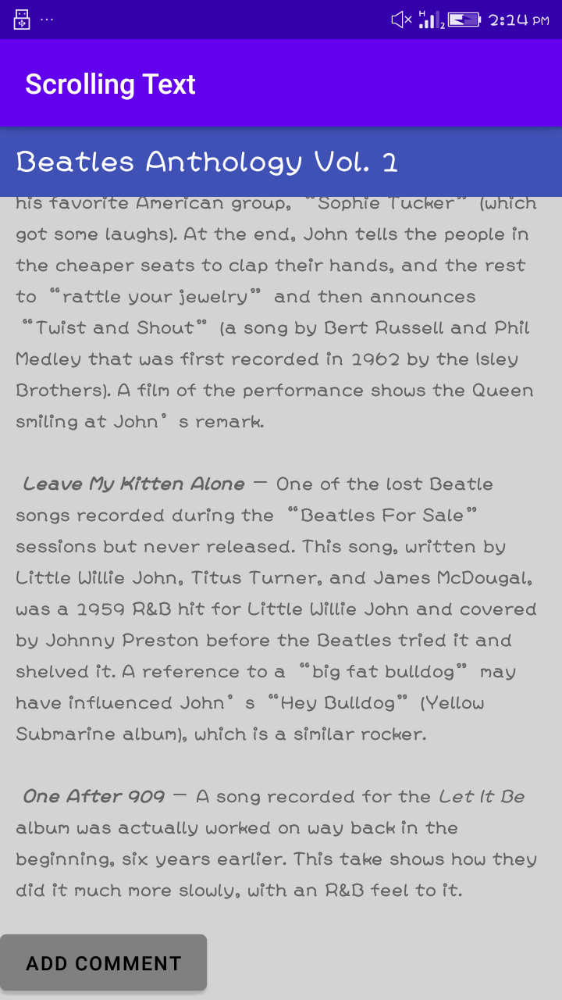

# Lab Work 3
## Text and scrolling views(Coding_Challenge)
**This is the third lab Exercise of "Text and scrolling views" consist of three textview and button elements and this readme file
consist of the screenshot and video i.e. gif file for the final app created**

### Button Added

**The above screenshot show the button added below the textView**

### Working Functionality of App

**The above video shows the working process of the application.The UI consist of three textview and
one scroll view. One textView as header and two textView is inside scrollView and the scrollview
consist of one child tag which is linear layout those two textview and one button in it.**