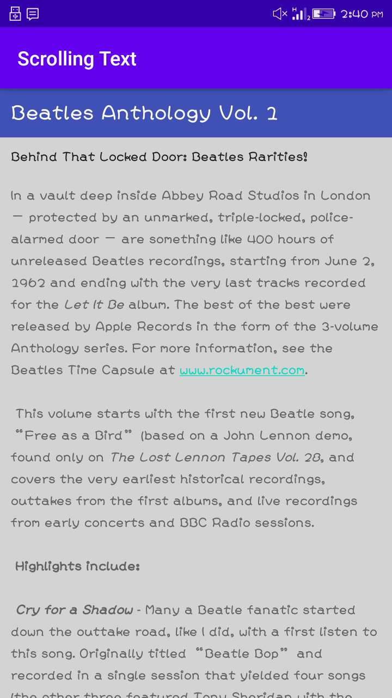
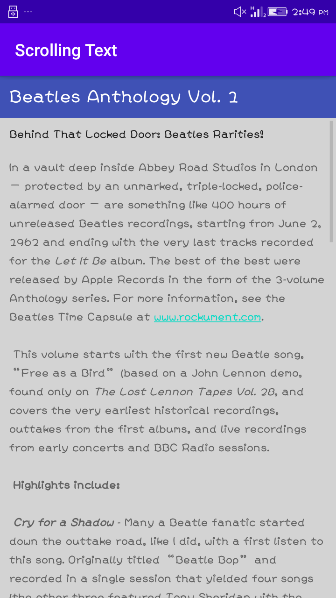

# Lab Work 3
## Text and scrolling views
**This is the third lab Exercise of "Text and scrolling views" and this readme file 
consist of the screenshot and video i.e. gif file for the final app created**
### Add and edit TextView elements

**The above screenshot show the Textview elements to the layout for an article title,subtitle and lengthy article**

### ScrollView and an active web link

**The above screenshot show the Textview elements with active web link as well as scrollView**

### Working Functionality of App
