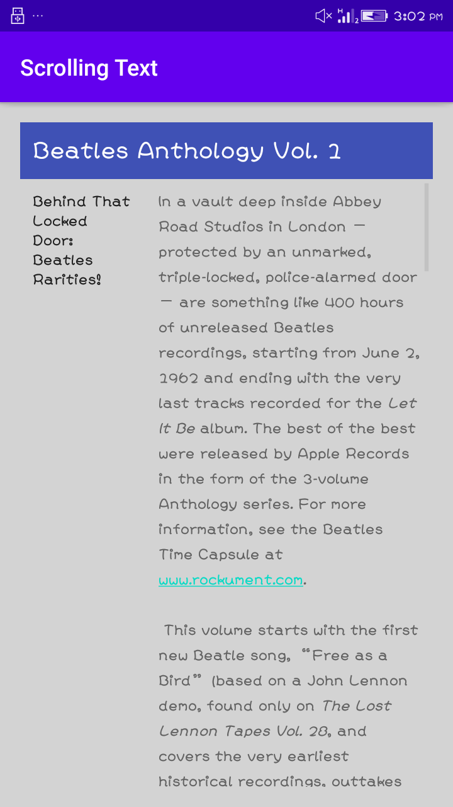

# Lab Work 3
## Text and scrolling views(Homework)
**This is the third lab Exercise of "Text and scrolling views" consist of three textview and this 
readme file consist of the screenshot and video i.e. gif file for the final app created**

### Application UI

**The above screenshot shows the subtitle at right and article at the left side**

### Working functionality of App 

**The above record shows the overall functionality of the app .The UI consist of three textview and one scroll view.
One textView as header and two textView is inside scrollView and the scrollview consist of one child
tag which is linear layout those two textview are inside it.**